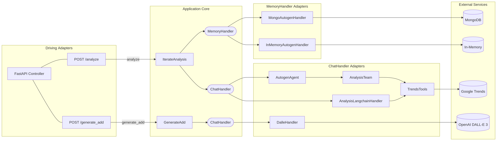

# iGeneris — Tourism Demand Analysis API

API REST para análisis de demanda turística y generación de anuncios publicitarios con IA.

---

## ¿Qué resuelve?

Las empresas de experiencias turísticas necesitan saber **a quién vender** y **cómo comunicarlo**. Esta API automatiza ese proceso en dos pasos:

1. **Analiza** el mercado de un destino turístico usando datos reales de tendencias de búsqueda, identificando los perfiles de cliente con mayor probabilidad de compra.
2. **Genera** una imagen publicitaria personalizada para ese público objetivo, lista para usar en campañas digitales.

---

## Funcionalidades

### `POST /conversation`
Crea una nueva conversación y devuelve un `conversation_id`. Este ID permite mantener contexto entre múltiples preguntas sobre el mismo destino.

### `POST /analyze`
Recibe una pregunta sobre un destino turístico y devuelve un análisis estructurado con:
- **Datos objetivos** extraídos de Google Trends (tendencias de búsqueda reales)
- **Recomendación experta** sobre qué experiencia promocionar y para qué perfil de cliente

El análisis es revisado por un agente de calidad antes de ser devuelto.

### `POST /generate_add`
Recibe el análisis previo y genera una **imagen publicitaria** con DALL-E 3, adaptada al público objetivo identificado en el análisis.

---

## Arquitectura

La aplicación sigue **arquitectura hexagonal (ports & adapters)**, lo que permite intercambiar implementaciones de infraestructura sin tocar la lógica de negocio.



### Capas principales

| Capa | Responsabilidad |
|------|----------------|
| `fastapi_controller/` | Exposición HTTP, modelos Pydantic de entrada/salida |
| `use_cases/` | Lógica de negocio: orquestar análisis y generación de imagen |
| `use_cases/port/` | Interfaces abstractas (puertos) |
| `autogen/` | Agentes AutoGen: team de análisis con reviewer |
| `langchain/` | Implementación alternativa con LangChain |
| `image_generation/` | Adaptador directo a DALL-E 3 |
| `memory/` | Persistencia de estado: MongoDB o in-memory |
| `data_sources/` | Conectores a Google Trends (real y mock) |

---

## Stack tecnológico

- **FastAPI** — API REST
- **AutoGen** — Orquestación multi-agente (agente experto + reviewer)
- **LangChain** — Implementación alternativa del agente de análisis
- **OpenAI GPT-4o-mini** — Modelo de lenguaje para el análisis
- **OpenAI DALL-E 3** — Generación de imágenes publicitarias
- **Google Trends** — Fuente de datos de demanda turística real
- **MongoDB** — Persistencia de conversaciones
- **Docker Compose** — Despliegue local con hot-reload

---

## Configuración

Variables de entorno relevantes (`.env`):

| Variable | Valores | Descripción |
|----------|---------|-------------|
| `CHAT_HANDLER` | `autogen` / `langchain` | Motor de IA para el análisis |
| `TRENDS_CONNECTOR` | `google` / `mock` | Fuente de datos de tendencias |
| `MEMORY_HANDLER` | `inmemory` / `mongo` | Backend de persistencia |
| `OPENAI_API_KEY` | — | Clave de OpenAI |

---

## Ejecución

```bash
# Con Docker Compose
cd compose && docker compose up

# Local
python -m src.main
```

Flujo completo de ejemplo:

```
1. POST /conversation                          → { "conversation_id": "abc-123" }
2. POST /analyze  { question, conversation_id} → { "analysis": "..." }
3. POST /generate_add { analysis, conversation_id } → { "image_url": "https://..." }
```
