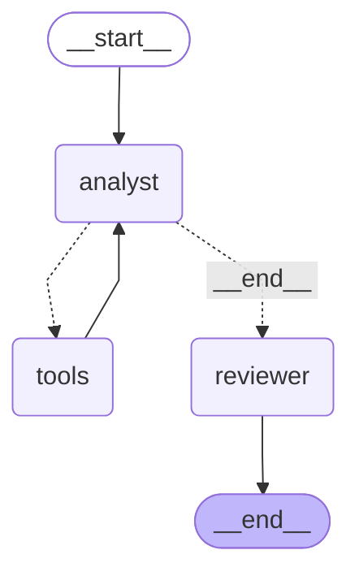

```mermaid
---
config:
  flowchart:
    curve: linear
---
graph TD;
	__start__([<p>__start__</p>]):::first
	analyst(analyst)
	tools(tools)
	reviewer(reviewer)
	__end__([<p>__end__</p>]):::last
	__start__ --> analyst;
	analyst -. &nbsp;__end__&nbsp; .-> reviewer;
	analyst -.-> tools;
	tools --> analyst;
	reviewer --> __end__;
	classDef default fill:#f2f0ff,line-height:1.2
	classDef first fill-opacity:0
	classDef last fill:#bfb6fc

```